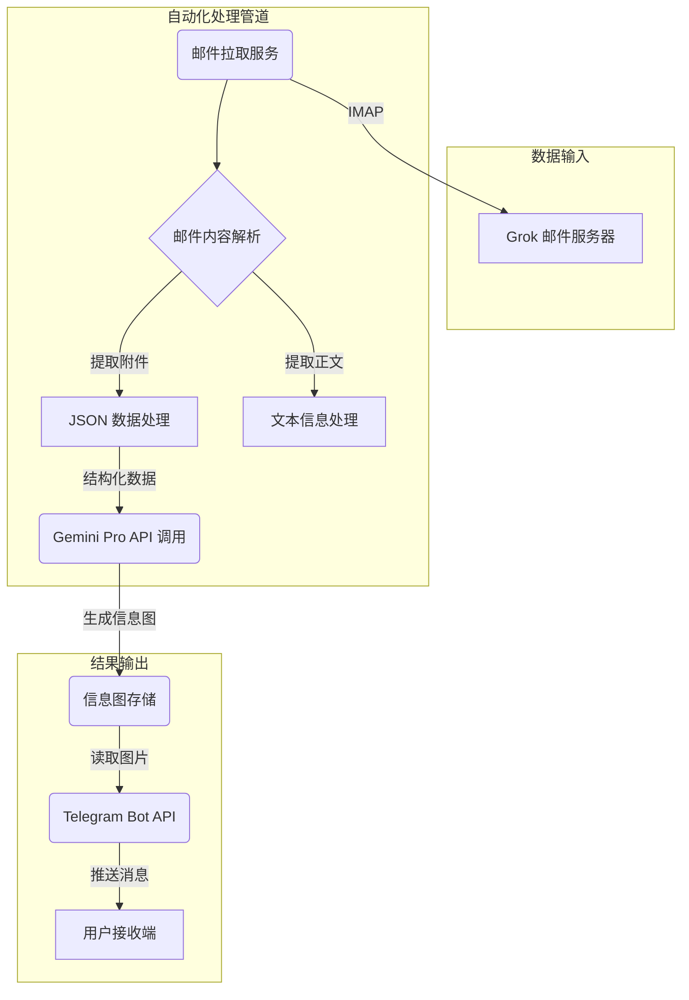

# GrokViz 产品需求文档 (PRD)

**版本**: 1.0

**作者**: Manus AI

**日期**: 2026年1月13日

---

## 1. 产品概述

### 1.1 背景与目标

在快速变化的加密货币市场中，及时获取并理解关键信息是做出明智决策的核心。Grok 日报作为一份高质量的信息源，每日提供市场洞察，但其纯文本和 JSON 数据的格式对于快速消费和直观理解构成了挑战。手动处理这些信息不仅效率低下，而且难以发现数据背后的深层关联。

本产品旨在构建一个**全自动化的工作流**，将 Grok 日报的核心内容转化为一张精炼、美观、易于传播的信息图。通过自动化邮件解析、AI 驱动的可视化生成以及即时的 Telegram 推送，我们致力于为用户提供一个高效、直观的市场洞察获取渠道，将每日关键信息“一图掌握”。

### 1.2 目标用户

| 用户画像 | 核心痛点 | 期望收益 |
| --- | --- | --- |
| :--- | :--- | :--- |
| **加密货币投资者与分析师** | 每日需处理大量文本信息，难以快速识别关键信号。 | 快速获取市场共识与非共识机会，提升决策效率。 |
| **Web3 从业者与研究员** | 关注行业宏观趋势和技术动态，但信息源分散，格式不一。 | 通过结构化、可视化的数据，高效把握行业脉搏。 |
| **KOL 与内容创作者** | 需要将复杂信息转化为易于传播的内容，以提升影响力。 | 获得高质量、可直接分享的信息图素材，节省内容创作时间。 |

### 1.3 成功指标

- **处理成功率**: >99% 的日报能够被成功处理并生成信息图。
- **端到端延迟**: 从接收邮件到发送 Telegram 消息的平均时间应小于 **3 分钟**。
- **用户满意度**: 通过未来可能引入的反馈机制，衡量用户对信息图质量和时效性的满意度。

---

## 2. 产品功能需求

### 2.1 功能总览

产品核心是一个自动化的数据处理与分发管道，其功能模块如下：

| 功能模块 | 核心描述 |
| --- | --- |
| :--- | :--- |
| **邮件订阅与解析模块** | 自动订阅并实时拉取 Grok 每日发布的邮件日报。 |
| **数据提取与处理模块** | 从邮件中精准提取“共识机会”、“非共识机会”等关键部分，并解析附带的 JSON 文件。 |
| **信息图生成模块** | 调用 Gemini Pro API，将结构化的 JSON 数据动态渲染为一张信息图。 |
| **Telegram 推送模块** | 将生成的信息图通过 Telegram 机器人即时推送给订阅用户。 |

### 2.2 详细功能描述

#### 2.2.1 邮件订阅与解析

- **需求描述**: 系统需能作为邮件客户端，通过 IMAP 协议连接指定邮箱，实时监控并下载来自 Grok 的日报邮件。
- **技术要求**:
    - 支持 IMAP IDLE 模式以实现近乎实时的邮件接收。
    - 能够解析 HTML 格式的邮件，并从中分离出文本内容和附件（JSON 文件）。
    - 建立健全的错误处理机制，如连接中断后的自动重连、邮件格式异常的告警等。

#### 2.2.2 数据提取与处理

- **需求描述**: 程序应能准确识别并提取邮件正文中的三个核心部分（信息收集与处理逻辑、共识机会与非共识机会、市场宏观与链上指标），并对附带的 JSON 数据进行严格的格式校验和解析。
- **技术要求**:
    - **优先使用邮件附件中的 JSON 文件**作为核心数据源。
    - 若 JSON 文件缺失，则启动备用方案，使用正则表达式或 DOM 解析技术从邮件正文中提取数据。
    - 对解析后的数据进行结构化处理，统一为后续生成模块所需的标准格式。

#### 2.2.3 信息图生成

- **需求描述**: 将处理好的 JSON 数据提交给 Gemini Pro 模型，通过一个精心设计的 Prompt 指导其生成一张内容全面、重点突出、设计精美的信息图（Infographic）。
- **输出格式**: PNG 格式，分辨率不低于 1200x1800 像素。
- **核心技术 - Prompt 设计**: Prompt 是保证输出质量的关键。它必须包含以下要素：
    
    > **角色扮演**: “你是一位顶尖的信息设计师，擅长将复杂数据转化为清晰、美观且易于理解的信息图。”
    > 
    
    > **任务指令**: “请根据以下 JSON 数据，为‘Grok Crypto Daily’创作一张信息图。图表需要清晰地展示‘共识机会’和‘非共识机会’两大板块。”
    > 
    
    > **布局与风格要求**: “整体风格采用现代、简洁的科技感设计。顶部设置标题‘Grok Crypto Daily Digest’和日期。‘共识机会’使用暖色调（如橙色、金色），‘非共识机会’使用冷色调（如蓝色、紫色）。每个机会点应包含名称、核心逻辑和关键证据，并使用一个热力值或潜力分数的视觉元素（如条形图、热力点）来表示其重要性。”
    > 
    
    > **数据输入**: “以下是需要可视化的数据：
    > 
    
    > `json
    > 
    
    > {{JSON_DATA}}
    > 
    
    > `”
    > 

#### 2.2.4 Telegram 推送

- **需求描述**: 程序在成功生成信息图后，立即通过一个预设的 Telegram 机器人将图片发送至指定频道或用户。
- **消息格式**:
    - **图片**: 生成的信息图。
    - **附言 (Caption)**: 包含日报标题、日期以及三个核心部分的简要文本总结，并附带相关的标签（如 `#GrokDaily` `#CryptoInsights`）。
- **技术要求**:
    - 集成 Telegram Bot API，确保稳定发送图片和长文本。
    - 提供发送状态的实时日志，并在发送失败时触发重试或告警机制。

---

## 3. 技术架构与实现方案

### 3.1 系统架构图

### 3.2 技术选型

| 模块 | 技术方案 | 理由 |
| --- | --- | --- |
| :--- | :--- | :--- |
| **核心脚本语言** | Python 3.11 | 生态丰富，拥有处理邮件、API 调用和自动化的成熟库。 |
| **邮件处理** | `imaplib`, `email` | Python 标准库，稳定可靠，无需额外依赖。 |
| **AI 模型调用** | `google-generativeai` | Google 官方 SDK，与 Gemini Pro 无缝集成。 |
| **Telegram Bot** | `python-telegram-bot` | 功能强大且社区活跃的 Telegram Bot 框架。 |
| **运行环境** | Docker | 实现环境隔离和标准化部署，便于迁移和扩展。 |
| **任务调度** | `cron` | Linux 系统自带的成熟任务调度工具，稳定且资源占用低。 |

---

## 4. 非功能性需求

| 需求类别 | 具体描述 |
| --- | --- |
| :--- | :--- |
| **稳定性** | 系统应能 7x24 小时不间断运行，具备详细的日志记录和基于关键错误的告警机制（例如，通过邮件或备用 Telegram 通道）。 |
| **性能** | 整个处理流程（从邮件拉取到 Telegram 推送）的 P95 延迟应控制在 5 分钟以内。 |
| **安全性** | 所有敏感凭证（如邮箱密码、API 密钥、Telegram Token）必须通过环境变量或专用的密钥管理服务进行管理，严禁硬编码在代码中。 |
| **可维护性** | 代码应遵循模块化设计，编写清晰的文档和注释。配置（如邮箱地址、Telegram 频道 ID）应与代码分离。 |

---

## 5. 未来规划与迭代

- **V1.1 (交互增强)**: 支持用户通过 Telegram 机器人发送指令，例如手动触发一次日报生成、查询历史某天的信息图等。
- **V1.2 (模板多样化)**: 引入多种信息图模板（如暗黑模式、紧凑布局），允许用户根据偏好进行选择。
- **V2.0 (多源聚合)**: 扩展数据源，支持接入除 Grok 日报外的其他信息源（如特定 Dune Analytics 仪表盘、Glassnode 报告），并提供统一的可视化输出。
- **V2.1 (网页端呈现)**: 创建一个简单的 Web 界面，用于归档和展示所有历史生成的信息图，方便用户回顾和检索。
